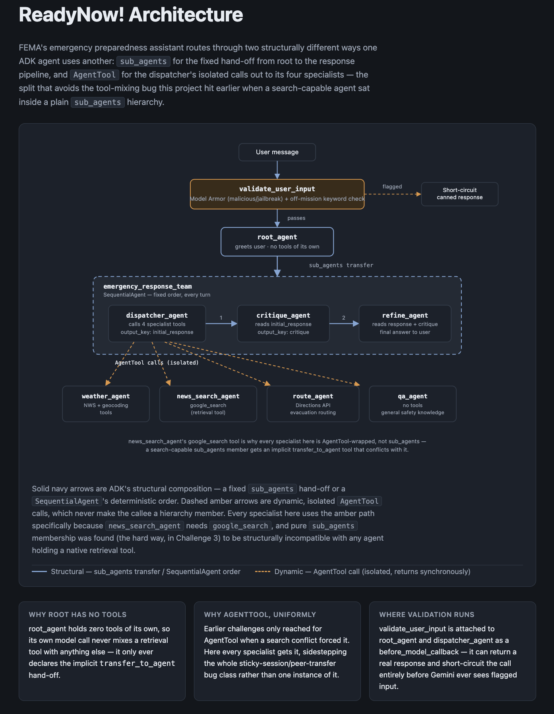
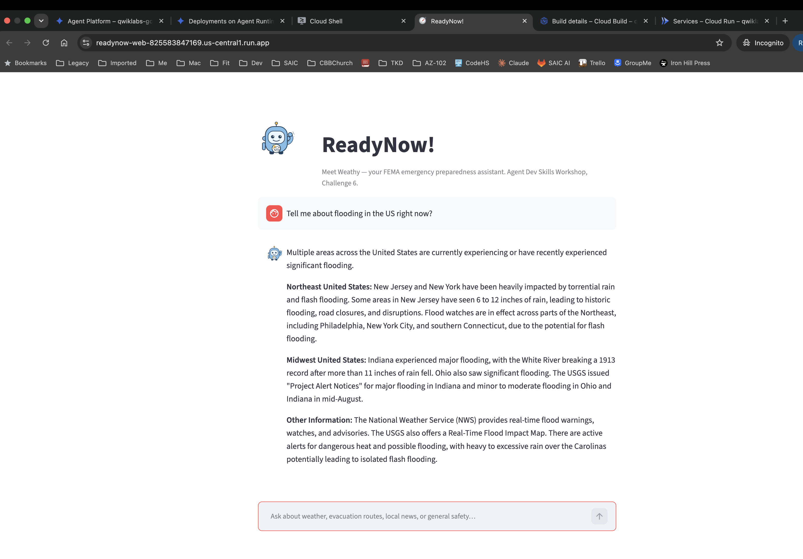

# Agent Dev Skills Workshop — Jay Watson

Workshop exercises building AI agents with Google's Agent Development Kit (ADK): function tools, callbacks and guardrails, multi-agent orchestration, session state, and multi-model support.

All 6 challenges are complete: built, tested against live Colab Enterprise output, deployed to Vertex AI Agent Engine, and pushed here.

## Challenge 1 — Building an Agent with Custom Tools

`Challenge1_JayWatson.ipynb`

An ADK weather agent that:
- Uses a custom tool wrapping the National Weather Service API (lat/long → current forecast)
- Uses a custom tool wrapping the Google Maps Geocoding API (city/state → lat/long)
- Supports both Gemini and a third-party model (Claude Haiku via LiteLLM, routed through a SAIC gateway)
- Is tested against multiple US cities with both models

## Challenge 2 — Guardrails: Logging and Input Validation Callbacks

`Challenge2_JayWatson.ipynb`

Builds on Challenge 1 by adding:
- `log_user_prompt` / `log_model_response` — before/after model callbacks that log every turn
- `validate_user_input` — a guardrail callback that blocks non-US locations and known malicious input patterns before the model ever sees them

## Challenge 3 — Multi-Agent Orchestration

`Challenge3_JayWatson.ipynb`

Introduces a `root_agent` that coordinates a weather sub-agent and a search agent:
- `search_agent` is wrapped as an `AgentTool` rather than added as a `sub_agent` — a pure-search agent placed directly in a `sub_agents` hierarchy picks up an implicit `transfer_to_agent` tool that conflicts with `google_search` on the same agent
- `disallow_transfer_to_peers=True` on the weather sub-agent prevents unwanted sideways hand-offs once a transfer becomes "sticky" for the rest of a session

## Challenge 4 — Sequential Workflow: Search, Critique, Refine

`Challenge4_JayWatson.ipynb`

Adds a `SequentialAgent` pipeline (`answer_team`) of `team_search_agent` → `critique_agent` → `refine_agent`, fronted by a `greeter_agent` entry point. Carries forward the Challenge 3 `AgentTool` fix unchanged.

## Challenge 5 — Deploying to Vertex AI Agent Engine

`Challenge5_JayWatson.ipynb`

Deploys `greeter_agent` to Vertex AI Agent Engine with `agent_engines.create()` and tests it both from the notebook and the Agent Engine console playground.
- `Challenge5_JayWatson_TestingDeployment.png` — deployment succeeding
- `Challenge5_JayWatson_ConsolePlaygroundTest.png` — console playground test

## Challenge 6 — ReadyNow! Case Study (FEMA Capstone)

`Challenge6_JayWatson.ipynb`

A self-contained FEMA emergency-preparedness assistant, "ReadyNow!":
- `root_agent` hands off via `sub_agents` to `emergency_response_team`, a `SequentialAgent` of `dispatcher_agent` → `critique_agent` → `refine_agent`
- `dispatcher_agent` reaches four specialists — weather, news search, evacuation routing (Google Maps Directions API), and general safety Q&A — each wrapped as an `AgentTool`, since `news_search_agent`'s `google_search` tool means none of them can be plain `sub_agents` members
- Google Cloud Model Armor (prompt injection / jailbreak detection) plus an off-mission keyword check, wired in as a `before_model_callback` on `root_agent` and `dispatcher_agent`
- Deployed to Vertex AI Agent Engine

- `Challenge6_JayWatson_TestingDeployment.png` — deployment succeeding
- `Challenge6_JayWatson_ConsolePlaygroundTest.png` — console playground test

Solid navy = structural `sub_agents` composition. Dashed amber = isolated `AgentTool` calls — used for every specialist here because `news_search_agent`'s `google_search` tool can't coexist with the implicit transfer tool a plain `sub_agents` membership would add.

## Bonus — Web Front End

`web/`

A Streamlit chat UI in front of the deployed ReadyNow! agent, hosted on Cloud Run, with **Weathy** 🧭 as the mascot — the header logo and every assistant chat bubble's avatar.

- `app.py` calls the already-deployed Agent Engine directly via `agent_engines.get()` + `stream_query()`, so the web app is a thin client on top of Challenge 6's deployment, not a second copy of the agent
- `weathy.svg` — hand-authored SVG mascot, wired in as `st.image` (header) and `st.chat_message(..., avatar=...)`
- `deploy.sh` — one idempotent script wrapping the IAM grant (`roles/aiplatform.user` for Cloud Run's service account) and the Cloud Run deploy
- `Dockerfile` — Cloud Build's shared worker pool was stuck queued for 15+ minutes during the live training day (likely cohort contention), so the container was built locally in Cloud Shell with `docker build` / `docker push` and deployed with `gcloud run deploy --image`, bypassing the remote build queue entirely

`Challenge6_JayWatson_WebAppDeployment.png` — the deployed app, live on Cloud Run.

